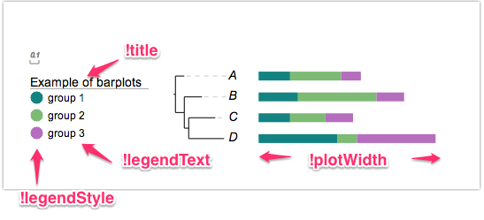

### Dataset Overview

#### A dataset typically consists of three sections
* [annotation](#annotation)
* [modifiers](#modifiers) and
* [data](#data)

Let's see some example first:

```
## -- here is an example dataset of a barplot;
## lines start with # are annotations and will not be parsed by EvolView --
## -- the following are the modifiers --
## -- please use TAB to separate the modifiers and their values
## -- !legendTitle   or !title
!legendTitle	Example of barplots
!legendText	group 1,group 2,group 3
!legendStyle	circle
!colors	#028482,#7ABA7A,#B76EB8
!plotwidth	200
## -- annotation can be also put here --
## -- here comes the data --
## -- please use TAB to separate the columns --
A	8,13,5
B	10,20,7
C	8,9,7
D	20,5,20
```

And here is the resulting visualisation:



##### Annotation

Lines with the first character as '#' are annotations.
Annotations are usually at the beginning of a dataset; however if desired, annotation lines can be placed anywhere in a dataset.

##### Modifiers

KA - pairs usually start with '!', and are separated by a single 'tab' character;
KA pairs are used to specify or change certain default settings / behavior of a dataset, for example:

* to set the title or legend
* to change the width, height or opacity of the dataset
* in some cases, the attribute part of a KA-pair is optional.

Here are a list of KA-pairs common to all datasets; dataset-specific KA-pairs will be introduced later.

|Key (case insensitive)|Value|Description|
|----------------------|-----|-----------|
|!Groups or !LegendText|comma separated text|Legend texts; for example 'group_a,group_b,group_c'|
|!LegendStyle or !Style|rect or circle or star|shapes to be plotted before the legend texts; default = rect|
|!LegendColors or !Colors|comma separated color codes or names|colors to be applied to the shapes specified by LegendStyle; for example 'red,green,yellow' ; note the number of colors should match the number of legend fields|
|!Title or !Legend|text|title of the legend; default = name of the dataset|
|!ShowLegends|0 or 1|0 : hide legends; 1 : show legends|
|!opacity|float number between 0 to 1|opacity of the dataset|
|!PlotWidth|integer > 0|pixel width of the dataset on canvas|

_**please always use TAB to separate the modifiers and their values!!**_

##### Data

Data are usually tab-delimited three-column texts; the first two columns are often mandatory, the third one is often optional.

_**first column: the location**_

the first column dictates where the data to be plotted. It usually contains the name of a leaf node, or two leaf names separated by a ','.

* one single leaf name dictates that the data will be plotted on / next to / under the leaf or the branch connecting directly to the leaf node
* two leaf names, on the hand, dictates that the data will be displayed on the branch representing the last common ancestor of the two leaf nodes
For example:
* chicken
* mouse,human

_**second column: data to be displayed**_

in bar plots, the data are the numbers representing the widths of the bars.
see more examples in each of the datasets

_**third column: optional commands to change the default behavior of the input**_

see the examples in each of the datasets.

| [next section: Strokes and colors >>](/datasets/01_stroke_color_and_width/DatasetStroke.md)
