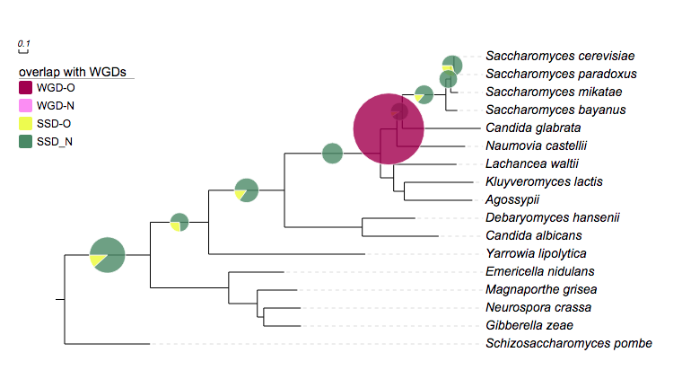

*Please email us ([Evolgenius Team](mailto:evolgenius.team@gmail.com)) if you have any questions; attach your datasets and trees if necessary.*

## Pie charts

### Table of contents
* [overview](#overview)
* [modifiers](#supported-modifiers)
* [examples](#examples)
* [show data value](#show-data-values)
* [add pie charts to trees with collapsed internal nodes](#add-pie-charts-to-trees-with-collapsed-internal-nodes)

### Overview
Pies will be displayed on internal and leaf branches.
Here is an example:


User can upload multiple pie-chart datasets to a tree, but only one can be displayed at a time.
Using the control panel on the page left, user can control which one can be displayed:


### Supported modifiers
Supported Key-Value pairs for pie charts:

|Key (case insensitive)|Value|Description|
|----------------------|-----|-----------|
|**universal modifiers**| | |
|!Groups or !LegendText|comma separated text|Legend texts; for example 'group_a,group_b,group_c'|
|!LegendStyle or !Style|rect or circle or star|shapes to be plotted before the legend texts; default = rect|
|!LegendColors or !Colors|comma separated color codes or names|colors to be applied to the shapes specified by LegendStyle; for example 'red,green,yellow' ;note the number of colors should match the number of legend fields|
|!Title or !Legend|text|title of the legend; default = name of the dataset|
|!ShowLegends|0 or 1|0 : hide legends; 1 : show legends|
|!opacity|float number between 0 to 1|opacity of the dataset|
|**pie charts specific**| | |
|!minradius|any float number > 0|minimal pixel radius of the pies|
|!maxradius|any float number > 0|maximal pixel radius of the pies|
|!area|none|use user inputs as the areas of the pie charts|
|!radius|none|use user inputs as the radiuses of the pie charts|
|**new: show data values|see section [#show data value](#show-data-value) for more details**| |

**_notes on preparing your dataset!!_**

* please always use TAB to separate the modifiers and their values.
* some modifiers should not be used in combination, e.g. !area and !radius are mutually exclusive.
* However if both are used (accidentally), only the last one will be used.
* if a modifier is used (accidentally) multiple tiles, only the last one will be used.
* the "data" part of this dataset can only contain two columns of tab-delimited texts; the third column, if presents, will be ignored

### Examples
The following we will provide you some examples.

You can copy & paste the tree and datasets to EvolView to reproduce the results.

The tree (in newick format):

```
((((((((((Saccharomyces_cerevisiae:0.054377,Saccharomyces_paradoxus:0.039196)Saccharomyces_subclade:0.035915,Saccharomyces_mikatae:0.082075)Saccharomyces_subclade:0.054132,Saccharomyces_bayanus:0.128022)Saccharomyces:0.485857,Candida_glabrata:0.874698)Saccharomycetaceae_subclade:0.060179,Naumovia_castellii:0.761269)Saccharomycetaceae_subclade:0.182516,(Lachancea_waltii:0.700985,(Kluyveromyces_lactis:0.770604,Agossypii:0.758273)Kluyveromyces:0.118441)Saccharomycetaceae_subclade:0.146942)Saccharomycetaceae:1.069627,(Debaryomyces_hansenii:0.591048,Candida_albicans:0.851762)Saccharomycetales_subclade:0.866539)Saccharomycetales_subclade:0.844816,Yarrowia_lipolytica:1.745091)Saccharomycetales:0.650477,(Emericella_nidulans:0.618015,(Magnaporthe_grisea:0.446021,(Neurospora_crassa:0.412753,Gibberella_zeae:0.414866)Sordariomycetes_subclade:0.071418)Sordariomycetes:0.318914)Pezizomycotina:0.873484)Ascomycota_subclade:0.955079,Schizosaccharomyces_pombe:0.952249);
```

dataset 1: "Duplication"

```
## for evolview; Yeast
!Groups	WGD,SSD
!colors	#9F0251,#4D8963
!legendstyle	circle
!title	Duplication mechanism
!opacity	0.8
Saccharomyces_cerevisiae,Saccharomyces_paradoxus	0,19
Saccharomyces_cerevisiae,Saccharomyces_mikatae	0,20
Saccharomyces_cerevisiae,Saccharomyces_bayanus	0,18
Saccharomyces_cerevisiae,Candida_glabrata	0,22
Saccharomyces_cerevisiae,Naumovia_castellii	862,0
Saccharomyces_cerevisiae,Lachancea_waltii	0,29
Saccharomyces_cerevisiae,Candida_albicans	0,53
Saccharomyces_cerevisiae,Yarrowia_lipolytica	0,26
Saccharomyces_cerevisiae,Neurospora_crassa	0,169
```

_**important!**_

* an internal branch / node is identified by the names of two leaf nodes; the former is the last common ancestor of the latter
* the values of an internal branches are separated by ",", e.g. 0,19
* the number of values of all internal nodes should be the same (two in this dataset)
* the same number of colors should be provided by "!colors" ("#9F0251,#4D8963" in this case)
* and the same number of "groups" should also provided by "!groups"


dataset 2: overlap with other duplicates

```
# for evolview; Yeast
## created at may 25, 2011
!Groups	WGD-O,WGD-N,SSD-O,SSD-N
!colors	#9F0251,#f88ef9,#effc00,#4D8963
!legendstyle	circle
!title	overlap with other duplicates
!opacity	0.8
Saccharomyces_cerevisiae,Saccharomyces_paradoxus	0,0,24,14
Saccharomyces_cerevisiae,Saccharomyces_mikatae	0,0,14,11
Saccharomyces_cerevisiae,Saccharomyces_bayanus	0,0,13,16
Saccharomyces_cerevisiae,Candida_glabrata	0,0,4,18
Saccharomyces_cerevisiae,Naumovia_castellii	77,792,0,0
Saccharomyces_cerevisiae,Lachancea_waltii	0,0,12,28
Saccharomyces_cerevisiae,Candida_albicans	0,0,18,42
Saccharomyces_cerevisiae,Yarrowia_lipolytica	0,0,11,16
Saccharomyces_cerevisiae,Neurospora_crassa	0,0,28,143
```



### Show data values

First, let's see an example using the same tree as above:

```
## for evolview; Yeast
## created at may 25, 2011
!Groups	WGD-O,WGD-N,SSD-O,SSD_N
!colors	#9F0251,#f88ef9,#effc00,#4D8963
!legendstyle	rect
!title	overlap with WGDs
!opacity	0.8
!showlegends	0
!showDataValue	show=1,fontsize=12,fontcolor=darkblue,titalic=1
Saccharomyces_cerevisiae,Saccharomyces_paradoxus	0,0,11,27
Saccharomyces_cerevisiae,Saccharomyces_mikatae	0,0,0,25
Saccharomyces_cerevisiae,Saccharomyces_bayanus	0,0,4,25
Saccharomyces_cerevisiae,Candida_glabrata	0,0,2,20
Saccharomyces_cerevisiae,Naumovia_castellii	869,0,0,0
Saccharomyces_cerevisiae,Lachancea_waltii	0,0,0,40
Saccharomyces_cerevisiae,Candida_albicans	0,0,9,51
Saccharomyces_cerevisiae,Yarrowia_lipolytica	0,0,7,20
Saccharomyces_cerevisiae,Neurospora_crassa	0,0,20,151
```


The 'value' of the 'key' !showdataValue can be any combination of the following, separated by a ",":

 modifiers|alternative value|description
 ---------|-----------------|-----------
|show = 1|0|show or hide data values; optional; the data values will be shown if omitted|
|fontsize=12|any integer|set font size; optional; default = 10|
|fontcolor=red|any valid HTML color name such as 'darkred' and hex color code such as '#FF0000' |set text color; optional; default = black|
|fontitalic=1|0|set font italic; optional; default = 0|

**more examples will be added ...**

### Add pie charts to trees with collapsed internal nodes

Evolview supports collapsing at internal nodes; collapsed nodes are treated as leaf nodes. It is therefore very straightforward to add pie charts to a collapsed tree. See [here](/datasets/13_collapse_at_internal_nodes/DatasetCollapseInternalNodes.md) for more information.

[<< previous section: Strokes and colors](/datasets/01_stroke_color_and_width/DatasetStroke.md)      |       [next section: bar chart >>](/datasets/03_bar/DatasetBars.md)
