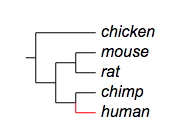
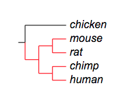

*Please email us ([Evolgenius Team](mailto:evolgenius.team@gmail.com)) if you have any questions; attach your datasets and trees if necessary.*

## Branch colors

### Table of contents
* [overview](#overview)
* [modifiers](#modifiers)
* [data](#data)
* [examples](#examples)
* [add branch color to a collapsed tree](#add-branch-color-to-a-collapsed-tree)

{anchor:overview}
### Overview
Branch colors will be applied to tree branches.
Similar to pie charts, multiple datasets for branch colors can be uploaded to a tree, but only one can be shown at a time.
Here is an example:


{anchor:modifiers}
### Supported modifiers
Supported Key-Value pairs for branch colors:
|Key (case insensitive)|Value|Description|
|----------------------|-----|-----------|
|!Groups or !LegendText|comma separated text|Legend texts; for example 'group_a,group_b,group_c'|
|!LegendStyle or !Style|rect or circle or star|shapes to be plotted before the legend texts; default = rect|
|!LegendColors or !Colors|comma separated color codes or names|colors to be applied to the shapes specified by LegendStyle; for example 'red,green,yellow' ; note the number of colors should match the number of legend fields|
|!Title or !Legend|text|title of the legend; default = name of the dataset|
|!ShowLegends|0 or 1|0 : hide legends; 1 : show legends|
|!opacity|float number between 0 to 1|opacity of the dataset|

{anchor:data}
### the data
Data are usually tab-delimited three-column texts, with the third column optional.
Let me use the tree below to illustrate the usage of the data:
```
(chicken,((mouse,rat),(chimp,human)));
```
* **first column: the location**
the first column dictates where the data to be plotted. It usually contains the name of a leaf node, or two leaf names separated by a ','.
* one single leaf name dictates that the data will be plotted on / next to / under the leaf or the branch connecting directly to the leaf node
* two leaf names, on the other hand, dictates that the data will be displayed on the branch representing the last common ancestor of the two leaf nodes
For example:
```
chicken
mouse,human
```
* **second column: color to be applied**
For example:
```
chicken	green
mouse,human	blue
```
* **third column: optional commands to change the default behavior of current line**
By default, the color will only apply to the specified branch; for example:
```
## branch color/ styles
human	red
```

----
By adding a third column, the default behavior can be changed. Here is a list of choices of this column:
|Option (case insensitive)|Description|
|-------------------------|-----------|
|ad|apply color to all descendants|
|prefix|apply color to all branches connecting leaf nodes whose name starts with the string specified by the first column|
|suffix|apply color to all branches connecting leaf nodes whose name ends with the string specified by the first column|
|anywhere|apply color to all branches connecting leaf nodes whose name contains the string specified by the first column|
|toroot|apply color to all branches connecting the leaf node and parent nodes all the way to the root|
See the examples below.

{anchor:example}
### Examples
Example 1, 'ad':
```
## branch color
human,mouse	red	ad
```

----
Example 2, 'prefix':
```
ch	red	prefix
```

----
Example 3, 'suffix':
```
n	red	prefix
```

----
Example 4, 'toroot':
```
## branch color from specified leaf node to the root
human	red	toroot
```

{anchor:add branch color to a collapsed tree}
### add branch color to a collapsed tree
Evolview supports collapsing at internal nodes; collapsed nodes are treated as leaf nodes. It is therefore very straightforward to add branch color to a collapsed tree. See [here](DatasetCollapseInternalNodes#branchcolors) for more information.

[<< previous section: bar chart ](/datasets/03_bar/DatasetBars.md)      |       [next section: leaf color >>](/datasets/05_leaf/DatasetLeafColor.md)
