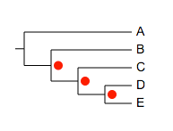
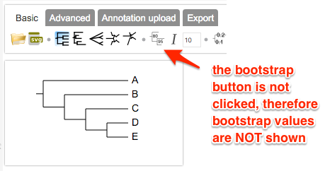
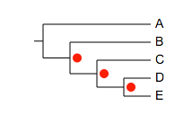
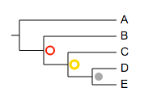
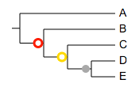
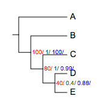
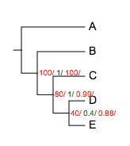
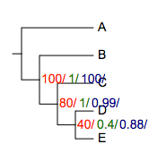

*Please email us ([Evolgenius Team](mailto:evolgenius.team@gmail.com)) if you have any questions; attach your datasets and trees if necessary.*

## Bootstrap value styles

### Table of contents
* [overview](#overview)
* [modifiers](#modifiers)
* [data](#data)
* [examples](#examples)
* [show multiple sets of bootstrap values](#showMultipleBootstraps)

{anchor:overview}
### Overview
Bootstrap value style allows users to tweak the displaying style of bootstrap values.
Here is an example.
The tree:
```
(A:0.1,(B:0.2,(C:0.3,(D:0.4,E:0.5)40:0.6)80:0.05)100:0.1)90:0.43;
```
... and a simple dataset
```
##bootstrap value styles
!bootstrapValueStyle	show=1,style=circle,size=10,place=1,color=red
```

NOTE: in order to show bootstrap values, the tree has to have bootstrap values, and the "Show/Hide bootstrap scores" button on the toolbar has to be activated:



{anchor:modifiers}
### Supported modifiers
In addition to the universal modifiers , an additional 'modifier' is supported:
**!bootstrapValueStyles** or **!bootstrapValueStyle** (case insensitive)
The value of this modifier can be any of the following options, individually or in combination:
|key|alternative value|description|
|--|--|--|
|show=1|0|show or hide all bootstrap values; optional; default = 1|
|style=numeric|any of the following:rect,circle,star,check,triangle|display bootstrap values as numbers or shapes; optional; default = numeric|
|size=10|any integer >= 0|set font size of the bootstrap values, or diameter of the shapes; optional, default = 10|
|color=red or color=red:blue|any valid html color name, e.g. green, darkblue ..., or hex html color, e.g. #FF00FF|set fill and optional stroke color for the bootstrap values ; optional, default = black; see examples below for detail|
|strokewidth=1|any integer >=1|set strokewidth for bootstrap values, valid only when the strokecolor is set; optional, default = 1; see examples below for detail|
|place=1|2 or 3 or 4|set the place where the bootstrap values to be displayed ; optional, default = 1; see examples below for detail|
**_notes on preparing your datasets!!_**
1. please always use TAB to separate the modifiers and their values.
2. if a modifier is used (accidentally) multiple tiles, only the last one will be used.
3. the "data" part of this dataset can only contain two columns of tab-delimited texts; the third column, if presents, will be ignored
4. please also always use TAB to separate the columns in the data section.

{anchor:data}
### data
Each line of data should consist of two parts, separated by a 'TAB' character.
the **_first part_** defines the range of the bootstrap values; it could be either a single numeric value, or two values separated by a ',' or ':'. For example:
* 80
* 90,100
* 70:80
please note that the values are inclusive.

the **_second part_** sets the display styles for bootstrap values in the range defined in the first part. The 2nd part should be written similarly to the value of **'!bootstrapValueStyles'**. For example:
* show=0,color=green,style=circle,size=20
* color=darkgreen
* style=rect,size=20
* are all valid.
**_NOTE:_**
1. unlike other annotation datasets, the data part of 'Bootstrap Value Styles' is optional; when omitted, the global options defined by modifier '!bootstrapValueStyle' will be applied to all bootstrap values
2. the data part, when available, will override the global options.

{anchor:examples}
### Examples
The tree:
```
(A:0.1,(B:0.2,(C:0.3,(D:0.4,E:0.5)40:0.6)80:0.05)100:0.1)90:0.43;
```
Example 1:
```
# bootstrap value style
## no data, global options will be applied to all bootstrap values
!bootstrapValueStyle	show=1,style=circle,size=10,place=1,color=red   
```

----
Example 2:
```
## hide bootstrap values less than 75, and apply colors according to bootstrap values
!bootstrapValueStyle	show=1,style=numeric,color=red
0,75	show=0
80,90	color=red,size=12
100,120	color=darkred,size=14
```

----
Example 3:
```
## plot bootstrap values as circles,
# and use different colors according to the corresponding values
!bootstrapValueStyle	show=1,style=circle
40	color=darkgrey
80	color=gold
100	color=red
```

----
Example 4:
```
## use stroke color and stroke width
!bootstrapValueStyle	show=1,style=circle
40	color=darkgrey
80	color=white:gold,strokewidth=3
100	color=white:red,strokewidth=2
```

----
Example 5:
```
## place=2
!bootstrapValueStyle	show=1,style=circle,place=2
40	color=darkgrey
80	color=white:gold,strokewidth=3
100	color=white:red,strokewidth=2   
```

----
Example 6:
```
## place=3
!bootstrapValueStyle	show=1,style=circle,place=3,strokewidth=3
40	color=darkgrey
60,80	color=white:gold
81,100	color=white:red  
```

----
Example 7:
```
## place=4
!bootstrapValueStyle	show=1,style=numeric,place=4,color=darkred
```

----
Example 8:
```
## a mixture of styles
!bootstrapValueStyle	show=1,style=circle,size=10,place=1,color=red,strokewidth=4
40	color=white:darkgrey
80	color=red:blue,style=rect,strokewidth=3
100	show=1,style=numeric
```

----
Example 9:
```
## with legend;
!Title	bootstrap
!Groups	<=40,41~80,81~100
!Colors	grey,gold,red
!LegendStyle	circle

!bootstrapValueStyle	show=1,style=circle
40	color=darkgrey
41,80	color=gold
81,100	color=red
```


{anchor:showMultipleBootstraps}
### Show multiple sets of bootstrap values
Evolview is starting to support multiple sets of bootstraps (meaning this functionality is still under-development). To do so users need to prepare the input tree in a very specific format, and a special "bootstrap style" dataset.

Here is an example:
... the input tree:
```
(A:0.1,(B:0.2,(C:0.3,(D:0.4,E:0.5)40/0.4/0.88:0.6)80/1/0.99:0.05)100/1/100:0.1)90/1/0.99:0.43;
```
note there are three sets of bootstrap values, they are written as '80/1/0.99'.

... the dataset:
```
!bootstrapValueStyle	show=1,style=multiple,size=10,color=red|green|blue
```

please note here:
1. style=**_multiple_**
2. 'color' has three color names, separated by '|'; if the number of colors is less than three (e.g. color=red|green), the colors will be cycled.

for example:
```
## there are three sets of bootstrap values, but only two colors:
!bootstrapValueStyle	show=1,style=multiple,size=10,color=red|green
```

----
of course the font size can be changed:
```
!bootstrapValueStyle	show=1,style=multiple,size=14,color=red|green|darkblue
```



[<< previous section: heatmap ](/datasets/10_heatmap/DatasetHeatmap.md)      |       [next section: column plot >>](/datasets/12_column_plot/DatasetColumnPlots.md)
