*Please email us ([Evolgenius Team](mailto:evolgenius.team@gmail.com)) if you have any questions; attach your datasets and trees if necessary.*

## Heatmap
### Table of contents
* [overview](#overview)
* [the !TimeLine modifier](#timeline)
* [1. the !TimeLineAxis modifier (Axis plot)](#timelineaxis)
* [2. the !TimeLineLines modifier (Line plot)](#timelinelines)
* [3. the !TimeLineStrips modifier (Strip plot)](#timelinestrips)

{anchor:overview}
### Overview
**_note:_**
# please consult the tree 'TimeLines' in the DEMOS project to see TimeLine plots in action
First, let's see some examples.
The tree:
```
(a,(d,(b:0.2,c:0.3):0.4):0.3);
```
... and an example dataset:
```
!TimeLine	TotalTime=70,TimeUnit=Millions of Years

!TimeLineAxis    
	Pos=Top,
        Ticks=20,10,5,
	TickLabelStyle=10,grey,0,0,
        Grid=0
```
resulting visualisation:
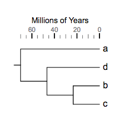

... another example dataset ....
```
!TimeLine	TotalTime=70,TimeUnit=Millions of Years

!TimeLineStrips   
	op=1,
	Strips=-11.67,11.67,35,58.33,81.67,
	StripColors=#F4F5F6,#E8E9EA,
	StripLabels=now,25,50,70,100,
	StripLabelStyle=12,#77787B,0,0,
	StripLabelPos=bottom,
        StripMarginPx=3
```
resulting visualisation:


{anchor:timeline}
### the '!TimeLine' modifier
The '!TimeLine' modifier is mandatory for all the following three types of timeline plots, the value of this modifier can be any combination of the following, separated by a ",":
The following 'modifiers' (Key-Value pairs) are supported for heatmap:
|(case insensitive)|Alternative value|Mandatory|Description|
|------------------|-----------------|---------|-----------|
|totaltime=70|any float number > 0|Y|Total time from the root to the most distant leaf|
|TimeUnit=Millions of Years|any string|N|Time unit|
**_please note:_**
* TimeLine plot supports multi-line key-value pairs, i.e. the modifier and its value can be split into multiple line, as long as they are written in the correct format; see examples above.
**_notes on preparing your datasets!!_**
# please always use TAB to separate the modifiers and their values.
# if a modifier is used (accidentally) multiple tiles, only the last one will be used.
# the "data" part of this dataset can only contain two columns of tab-delimited texts; the third column, if presents, will be ignored
# please also always use TAB to separate the columns in the data section.

{anchor:timelineaxis}
### 1. the '!timeLineAxis' modifier  (Axis plot)
This modifier defines an axis and related parameters; the value of this modifier can be any combination of the following, separated by a ",":
|(case insensitive)|Alternative value|Mandatory|Description|
|------------------|-----------------|---------|-----------|
|pos=Top|Bottom|N|position (above or at the bottom of the tree) at which the axis will be plotted; default=top|
|Ticks=10,5,1|any float numbers|Y|positions at which the 'major', 'minor' and 'other' ticks will be plotted; ticks=10 means a major tick will be plotted every 10 TimeUnit; ticks=10,5 means in addition to major ticks, a minor tick will be plotted every 5 TimeUnit; see examples below for details|
|TickLabels=A,B,C|any strings or numbers|N|customized labels for major ticks; by default, the tick labels are their corresponding values; see examples below|
|TickColors=red,blue,green|any valid HTML color names or hex colors|N|colors to be applied to ticks; if only one color is set (e.g. TickColors=red), the specified color will be applied to the major ticks; if two colors are set (e.g. TickColors=red,blue), they will be applied to the major and minor ticks respectively; see below for examples|
|TickLabelStyle=10,grey,1,0|here '10'==font size, 'grey'==font color, '1'==font italic, '0'==font bold|N|styles of tick labels|
|Grid=0|1|N|if ==1, plot grid lines at major and minor ticks; see examples below|

#### Examples
The tree:
```
(a,(d,(b:0.2,c:0.3):0.4):0.3);
```

Datasets:
1. Axis on top:
```
!TimeLine	TotalTime=70,TimeUnit=Millions of Years

!TimeLineAxis    
       # axis position
	Pos=Top,
    Ticks=20,10,5,
	TickLabelStyle=10,grey,0,0,
    Grid=0
```
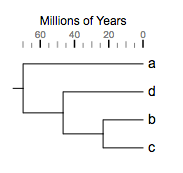
----
2. Axis at bottom:
```
!TimeLine	TotalTime=70,TimeUnit=Millions of Years

!TimeLineAxis    
       # axis position 'bottom'
	Pos=bottom,
    Ticks=20,10,5,
	TickLabelStyle=10,grey,0,0,
    Grid=0
```
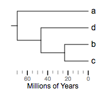
----
3. major tick only:
```
!TimeLine	TotalTime=70,TimeUnit=Millions of Years

!TimeLineAxis    
	Pos=top,
    # major tick only
    Ticks=20,
	TickLabelStyle=10,grey,0,0,
    Grid=0
```

----
4. major and minor ticks:
```
!TimeLine	TotalTime=70,TimeUnit=Millions of Years

!TimeLineAxis    
	Pos=top,
    # major and minor ticks
    Ticks=20,10,
	TickLabelStyle=10,grey,0,0,
    Grid=0
```
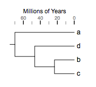
----
5. major, minor and other ticks:
```
!TimeLine	TotalTime=70,TimeUnit=Millions of Years

!TimeLineAxis    
	Pos=top,
    # major, minor and other ticks
    Ticks=20,10,5,
	TickLabelStyle=10,grey,0,0,
    Grid=0
```

----
6. customized tick label:
```
!TimeLine	TotalTime=70,TimeUnit=Millions of Years

!TimeLineAxis    
	Pos=top,
    Ticks=20,10,5,
	TickLabelStyle=10,grey,0,0,
    # customized tick labels
    TickLabels=A,B,C,D,E,
    Grid=0
```
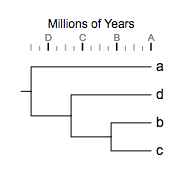
----
7. customized tick colors:
```
!TimeLine	TotalTime=70,TimeUnit=Millions of Years

!TimeLineAxis    
	Pos=top,
    Ticks=20,10,5,
	TickLabelStyle=10,grey,0,0,
    TickLabels=A,B,C,D,E,
    # customized tick colors
    TickColors=red,blue,green,
    Grid=0
```

----
8. tick label styles:
```
!TimeLine	TotalTime=70,TimeUnit=Millions of Years

!TimeLineAxis    
	Pos=top,
    Ticks=20,10,5,
        ## tick label styles
	TickLabelStyle=12,darkred,1,0,
    TickLabels=A,B,C,D,E,
    TickColors=red,blue,green,
    Grid=0
```

----
9. show grid lines:
```
!TimeLine	TotalTime=70,TimeUnit=Millions of Years

!TimeLineAxis    
	Pos=top,
    Ticks=20,10,5,
	TickLabelStyle=12,darkred,1,0,
    TickLabels=A,B,C,D,E,
    TickColors=red,blue,green,
    ## show grid line
    Grid=1
```
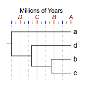
----

{anchor:timelinelines}
### 2. the '!timeLineLines' modifier  (Line plot)
This modifier defines a set of time points at which lines will be plotted; this modifier can also be used to annotate these lines and control the visualisation styles of the lines. The value of this modifier can be any combination of the following, separated by a ",":
|(case insensitive)|Alternative value|Mandatory|Description|
|------------------|-----------------|---------|-----------|
|op=0.9|any float number between 0~1|N|opacity of the lines; default = 1|
|lines=0,10,25,33,56|any float numbers separated by ','|Y|time points at which lines will be plotted;|
|LineWidths=1,2|any float number or numbers|N|line widths; default = 1; if the number of widths is less than the number of lines, these widths will be cycled.|
|LineLabels=Label1,B,Label2|any strings or numbers, separated by ','|N|text labels for lines; see examples below|
|LineColors=red,blue,green|any valid HTML color names or hex colors|N|colors to be applied to lines; if the number of colors is less than the number of lines, these colors will be cycled; default == black|
|LineLabelStyles=10,grey,1,0|here '10'==font size, 'grey'==font color, '1'==font italic, '0'==font bold|N|styles of line labels|
|LineLabelPos=Top|Bottom|N|position (above or at the bottom of the tree) at which the line labels will be plotted; default=top|

#### Examples
The tree:
```
(a,(d,(b:0.2,c:0.3):0.4):0.3);
```

1. a timeline line plot will all available parameters:
```
## note: in any timeline plot, the !TimeLine modifier is always mandatory --
!TimeLine	TotalTime=70,TimeUnit=Millions of Years

!TimeLineLines    
	op=0.9,
	Lines=4,25,56,70,
	LineStyles=solid,dashed,
	lineWidths=1,2,4,
	lineColors=pink,blue,darkred,
	LineLabels=A,B,C,
	LineLabelStyle=12,black,1,1,
	lineLabelPos=bottom
```

----

2. some simple lines:
```
!TimeLine	TotalTime=70,TimeUnit=Millions of Years

!TimeLineLines    
	Lines=4,25,56,70
```
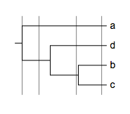
----
3. with line styles ('solid' and 'dashed'):
```
!TimeLine	TotalTime=70,TimeUnit=Millions of Years

!TimeLineLines    
	op=0.9,
	Lines=4,25,56,70,
        # line styles
	LineStyles=solid,dashed
```
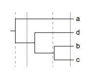
----
4. with line widths:
```
!TimeLine	TotalTime=70,TimeUnit=Millions of Years

!TimeLineLines    
	op=0.9,
	Lines=4,25,56,70,
	LineStyles=solid,dashed,
	lineWidths=1,2,4
```
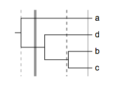
----
5. line colors:
```
!TimeLine	TotalTime=70,TimeUnit=Millions of Years

!TimeLineLines    
	op=0.9,
	Lines=4,25,56,70,
	LineStyles=solid,dashed,
	lineWidths=1,2,4,
	lineColors=pink,blue,darkred
```

----
6. line labels:
```
!TimeLine	TotalTime=70,TimeUnit=Millions of Years

!TimeLineLines    
	op=0.9,
	Lines=4,25,56,70,
	LineStyles=solid,dashed,
	lineWidths=1,2,4,
	lineColors=pink,blue,darkred,
	LineLabels=A,B,C
```

----
7. line label styles:
```
!TimeLine	TotalTime=70,TimeUnit=Millions of Years

!TimeLineLines    
	op=0.9,
	Lines=4,25,56,70,
	LineStyles=solid,dashed,
	lineWidths=1,2,4,
	lineColors=pink,blue,darkred,
	LineLabels=A,B,C,
	LineLabelStyle=12,black,1,1
```
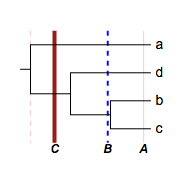
----

{anchor:timelinestrips}
### 3. the !TimeLineStrips modifier (Strip plot)
This modifier defines a set of color strips to be plotted behind the trees; users will be allowed to annotate the strips and control their visualisation styles. The value of this modifier can be any combination of the following, separated by a ",":
|(case insensitive)|Alternative value|Mandatory|Description|
|------------------|-----------------|---------|-----------|
|op=0.9|any float number between 0~1|N|opacity of the strips (does not apply to the labels); default = 1|
|strips=0,10,25,33,56|any float numbers separated by ','|Y|time points for strips; note: '0,10' defines a strip between 0~10; '0,10,25' defines two strips, 0~10 and 10~25; '0,10,25,33' defines three strips;|
|StripColors=red,blue,green|any valid HTML color names or hex colors, separated by ','|N|fill-colors for the strips; if the number of colors is less than the number of strips, these colors will be cycled; default == black|
|StripLabels=Label1,B,Label2|any strings or numbers, separated by ','|N|text labels for strips; see examples below|
|StripLabelStyle=10,grey,1,0|here '10'==font size, 'grey'==font color, '1'==font italic, '0'==font bold|N|styles of the text labels|
|StripLabelPos=Top|Bottom|N|position (above or at the bottom of the tree) at which the text labels will be plotted; default=top|
|StripMaginPx=3|any float number|N|margin size for the strips in pixel|
|ShowTimeUnit=1|0|N|show or hide time unit; see examples below|

#### Examples
The tree:
```
(a,(d,(b:0.2,c:0.3):0.4):0.3);
```
Datasets and visualisation results:

1. a single strip:
```
!TimeLine	TotalTime=70,TimeUnit=Millions of Years

!TimeLineAxis
	ticks=20,10,5,Pos=top

!TimeLineStrips   
	Strips=10,20,
	StripColors=#E8E9EA,
	StripLabels=some years ago,
	StripLabelPos=bottom,
        ShowTimeUnit=0
```

... in circular mode:

----
2. two strips (actually there are three strips, but the 2nd one is 'white'):
```
!TimeLine	TotalTime=70,TimeUnit=Millions of Years

!TimeLineAxis
	ticks=20,10,5,Pos=top

!TimeLineStrips   
	Strips=10,20,50,65,
	StripColors=#E8E9EA,white,#F5F5DC,
	StripLabels=time A,,time B,
	StripLabelPos=bottom,
    ShowTimeUnit=0
```
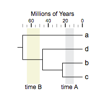
----


[<< previous section: Collapse at internal nodes](DatasetCollapseInternalNodes)   
