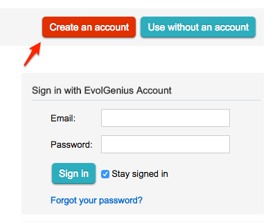

### Why crete an account?
EvolView is free for all users; all functionalities, except those require a connection to remote MySQL servers, are available to non-registered users. However there are many benefits for registered users (registration is free); with an account, you can:
* save your trees and datasets on our MySQL server,
* save your all customizations, including zoom in and out of your tree, the positions of your tree on the canvas and many others on user MySQL server,
* access your trees and datasets from any computer with internet connection, and
* many more ...
### How to create an account?
To sign up, click the "Create an account" button on the top of the "login" page:

Then fill the form in the popup dialog box and click "Create my account"; all fields with "*" are mandatory.
If there is no errors occurred during the registration, a dialogbox will popup and inform the user that the new account is ready!!
### What if the password I choose is the same for my Gmail or even my bank account?
Please note that for security and privacy reasons, we would never save the original password string you entered on our server; instead, only an encrypted version is kept (see below).

As far as we can tell, the encryption cannot be reverse engineered so that the original password string is only known to yourself.
Every time you login, the password that you enter will be encrypted again using the same algorithm, then the encrypted string will be compared with the one on our server. You'll login successfully if the two strings match.

|  [next section: Use anonymously >>](UseAnonymousely) 