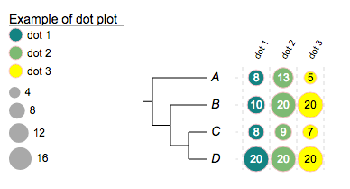
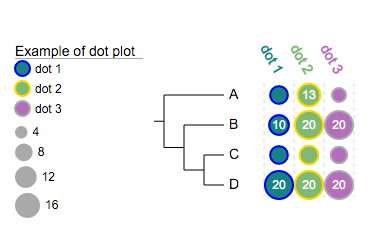

_Please email us ([Evolgenius Team](mailto:evolgenius.team@gmail.com)) if you have any questions; attach your datasets and trees if necessary. _

## Dot plots
Dot plot is a variant of Bar chart, therefore a dataset for Bar charts can be used directly.

### Table of contents
* [#overview](#overview)
* [#modifiers](#modifiers)
* [#the !dotplots modifier](#the-!dotplots-modifier)
* [#strokes](#strokes)
* [#show data value](#show-data-value)
* [#hide some values](#hide-some-values)
* [#customise column label styles](#customise-column-label-styles)
* [#examples](#examples)
* [#add dotplots to collapsed trees](#add-dotplots-to-collapsed-trees)

{anchor:overview}
### Overview
Let's see some examples:
The tree:
{{
(A:0.1,(B:0.2,(C:0.3,D:0.4)100:0.05)100:0.1)90:0.43;
}}
... and an example dataset:
{{
##dot plots
!groups	dot 1,dot 2,dot 3
!colors	#028482,#7ABA7A,yellow
!title	Example of dot plot
# -- legends --
!legendstyle	circle
!showLegends	1
## -- if !scalebycol is set to 1, each column of data will be scaled independently
!scalebycol	0
!byarea	1
# ---- grid and grid label / group label are also supported --
!grid	1
!gridlabel	1
# stroke and stroke color also work here
!defaultStrokeColor	pink
#!defaultStrokeWidth	2
# here shape can be 'rect' or 'circle'; roundedcorner only applies to 'rect' shapes ...
!dotplots	shape=circle,margin=2,colwidth=30,roundedcorner=3
## -- show data value works at here as well --
!showdataValue	show=1,fontsize=12,fontcolor=black
A	8,13,5
B	10,20,20
C	8,9,7
D	20,20,20
}}

By default, data are represented by dots / filled circles; however they could be alternatively represented by rectangular:
{{
##dot plots
!groups	dot 1,dot 2,dot 3
!colors	#028482,#7ABA7A,yellow
!title	Example of dot plot
!legendstyle	rect
!showLegends	1
!byarea	1
!grid	1
!gridlabel	1
!defaultStrokeColor	pink
#!defaultStrokeWidth	2
!dotplots	shape=rect,margin=2,colwidth=30,roundedcorner=3
!showdataValue	show=1,fontsize=12,fontitalic=0,textalign=start,fontcolor=black
A	8,13,5
B	10,20,20
C	8,9,7
D	20,20,20A	8,13,5
B	10,20,20
C	8,9,7
D	20,20,20
}}

{anchor:modifiers}
### Supported modifiers
The following 'modifiers' (Key-Value pairs) are supported for dot plots:
||Key (case insensitive)||Value||Description||
|**universal modifiers**| | |
|!Groups or !LegendText|comma separated text|Legend texts; for example 'group_a,group_b,group_c'|
|!LegendStyle or !Style|rect or circle or star|shapes to be plotted before the legend texts; default = rect|
|!LegendColors or !Colors|comma separated color codes or names|colors to be applied to the shapes specified by LegendStyle; for example 'red,green,yellow' ; note the number of colors should match the number of legend fields|
|!Title or !Legend|text|title of the legend; default = name of the dataset|
|!ShowLegends|0 or 1|0 : hide legends; 1 : show legends|
|!opacity|float number between 0 to 1|opacity of the dataset|
|**modifiers shared with Bar Charts**| |modifiers that apply to both Bar Charts and Dot Plots|
|!grid|none|show a background grid|
|!gridlabel or !axis|none|show grid labels (note: does not work in circular modes|
|!defaultStrokeWidth|any value >= 0|stroke width that applies to both legends and the chart|
|!defaultStrokeColor|any valid color name such as red and yellow and html hex color such as #FF00FF|stroke color that applies to both legends and the chart; see more about stroke colors; also see the section below|
|**dot plots specific**| | |
|!scalebycol|none|scale the data by column, i.e. the max value in a column will take the maximum plot width of a column; default is to scale by the maximum of all data|
|**other modifiers** | | |
|!dotplots| |see section below for more details| |
|!showdataValue | |see section show data value for more details|
|!columnLabelStyle| |tweak column label styles; see 'column label style' below for detail|
**_notes on preparing your datasets!!_**
# please always use TAB to separate the modifiers and their values.
# if a modifier is used (accidentally) multiple tiles, only the last one will be used.
# the "data" part of this dataset can only contain two columns of tab-delimited texts; the third column, if presents, will be ignored
# please also always use TAB to separate the columns in the data section.

{anchor:the !dotplots modifier}
### The !dotplots modifier
The 'value' of the modifier **!dotplots** can be any combination of the following, separated by a ",":
{{
shape=circle,margin=2,colwidth=30,roundedcorner=3
}}
|| ||alternative value||description||
|shape = circle|rect|shape of the dot plots; default is circle|
|colwidth=30|any integer > 0|set pixel width per column ; optional; default = 20|
|margin=2|any integer >= 0|set pixel space between columns; optional; default = 0|
|roundedcorner=1|any integer >= 0|set rounded corner in pixels for rectangular; valid when shape=rect; optional, default = 0|

{anchor:strokes}
### Strokes
User can choose different stroke colors for different columns using the modifier !colors; for example, by simply changing the value of !colors to :
{{
#028482:blue,#7ABA7A:gold,#B76EB8:darkgrey
}}
For example:
{{
##dot plots
!groups	dot 1,dot 2,dot 3
## -- set stroke color --
!colors	#028482:blue,#7ABA7A:gold,#B76EB8:darkgrey
## -- set stroke width to 2 --
#!defaultStrokeColor	pink
!defaultStrokeWidth	2
!title	Example of dot plot
!legendstyle	circle
!showLegends	1
!byarea	1
!grid	1
!gridlabel	1
!dotplots	shape=circle,margin=2,colwidth=30,roundedcorner=3
!showdataValue	show=1,fontsize=12,fontcolor=white
A	8,13,5
B	10,20,20
C	8,9,7
D	20,20,20
}}

{anchor:show data value}
### Show data value
The 'value' of the modifier **!showdataValue** can be any combination of the following, separated by a ",":
|| ||alternative value||description||
|show = 1|0|show or hide data values; optional; the data values will be shown if omitted|
|fontsize=12|any integer|set font size; optional; default = 10|
|fontcolor=red|any value color name|set text color; optional; default = 'black' or 'white' depending on the background color|
|fontitalic=1|0|set font italic; optional; default = 0|
|valuesToHide=value1, or valuesToHide=value1:value2|any number(s)|specify a single value to hide, e.g. valuesToHide=9, or a range of values to hide, e.g. valuesToHide=0.5:10 (inclusive). Default is to hide none|
**_NOTE_**: when 'fontcolor' is omitted, the default font color will be either 'black' or 'white' depending the background color, for example:
{{
!groups	dot 1,dot 2,dot 3
!colors	#028482,#7ABA7A,yellow
!title	Example of dot plot
!legendstyle	circle
!showLegends	1
!byarea	1
!grid	1
!gridlabel	1
!defaultStrokeColor	pink
!dotplots	shape=circle,margin=2,colwidth=30,roundedcorner=3
!showdataValue	show=1,fontsize=12,fontitalic=0,textalign=start
A	8,13,5
B	10,20,20
C	8,9,7
D	20,20,20
}}
The purpose here is to ensure the readability of the texts on any background colors.

----
In this particular case, if we force the text color to 'white':
{{
!groups	dot 1,dot 2,dot 3
!colors	#028482,#7ABA7A,yellow
!title	Example of dot plot
!legendstyle	circle
!showLegends	1
!byarea	1
!grid	1
!gridlabel	1
!defaultStrokeColor	pink
!dotplots	shape=circle,margin=2,colwidth=30,roundedcorner=3
!showdataValue	show=1,fontsize=12,fontcolor=white
A	8,13,5
B	10,20,20
C	8,9,7
D	20,20,20
}}
... the texts of the 3rd column where the background color is yellow are unreadable:

{anchor:hide some values}
### Hide a value or a range of values
Now we are going to hide values from 5 to 9 (inclusive):
{{
!groups	dot 1,dot 2,dot 3
!colors	#028482,#7ABA7A,yellow
!title	Example of dot plot
!legendstyle	circle
!showLegends	1
!byarea	1
!grid	1
!gridlabel	1
!defaultStrokeColor	pink
!dotplots	shape=circle,margin=2,colwidth=30,roundedcorner=3
!showdataValue	show=1,fontsize=12,fontitalic=0,textalign=start,valuesToHide=5:9
A	8,13,5
B	10,20,20
C	8,9,7
D	20,20,20
}}

{anchor:customise column label styles}
### Customise column label styles
**_NOTE_**: modifier **!columnLabelStyle** is also supported by heatmap.
The 'value' of the modifier **!columnLabelStyle** can be any combination of the following, separated by a ","; for example:
{{
show=1,fontsize=14,fontitalic=0,fontbold=1,textangle=60,fontcolor=red
}}
|| ||alternative value||description||
|show = 1|0|show or hide data values; optional; if omitted, the column lables will be shown|
|fontsize=12|any integer|set font size; optional; default = 10|
|fontcolor=red|any value color name|set text color for all labels; optional; default = colors matching the corresponding columns|
|fontitalic=1|0|set font italic; optional; default = 0|
|fontbold=1|0|set font weight to bold; optional; default = 0|
|textangle=-60|any number(s)|set rotation angle; optional, default = -60|
Here is an example:
{{
##dot plots
!groups	dot 1,dot 2,dot 3
## -- set stroke color --
!colors	#028482:blue,#7ABA7A:gold,#B76EB8:darkgrey
## -- set stroke width to 2 --
#!defaultStrokeColor	pink
!defaultStrokeWidth	2
!title	Example of dot plot
!legendstyle	circle
!showLegends	1
!byarea	1
!grid	1
!gridlabel	1
!dotplots	shape=circle,margin=2,colwidth=30,roundedcorner=3
!showdataValue	show=1,fontsize=12,fontcolor=white,valuestohide=5:9

!columLabelStyle	show=1,fontsize=14,fontbold=1,textangle=60

A	8,13,5
B	10,20,20
C	8,9,7
D	20,20,20
}}

{anchor:examples}
### Examples
More examples will be added.
{anchor:add dotplots to collapsed trees}
### Add dotplots to collapsed trees
Evolview supports collapsing at internal nodes; collapsed nodes are treated as leaf nodes. It is therefore very straightforward to add dot plots to a collapsed tree. See [here](DatasetCollapseInternalNodes#dotplots) for more information.

[<< previous section: Group labels](DatasetGroupLabel)      |       [next section: Heatmap >>](DatasetHeatmap) 

