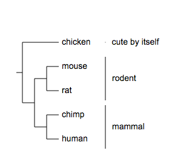
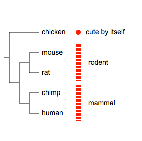
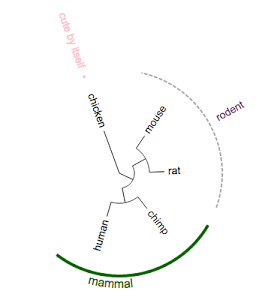

_Please email us ([Evolgenius Team](mailto:evolgenius.team@gmail.com)) if you have any questions; attach your datasets and trees if necessary. _

## Group label
please consult our examples trees 'group label', 'group label style 3' and 'group label style 4' in the DEMOS project.

### Table of contents
* [#overview](#overview)
* [#modifiers](#modifiers)
* [#data](#data)
* [#visualisation styles](#visualisation-styles)
* [#examples](#examples)
* [#add group label to collapsed trees](#add-group-label-to-collapsed-trees)

{anchor:overview}
### Overview
Group labels will be showed next to the leaf labels:
* it falls into the 'Charts' category, and
* multiple Group Labels datasets can be displayed at the same time
* however, some styles (3, 4 and 5) have to be the first one of all charts; see examples below
Here is an quick example (display styles 5,2 and 1 out of in total 5 styles ):

{anchor:modifiers}
### Supported modifiers
Apart from the common modifiers such as those that are related to legends, Group Labels supports an additional modifier: **!groupLabel**.
The value of this modifier defines default settings for all group labels and can be any combination of the following, separated by a ",":
|| ||alternative value||description||
|show=1|0|show or hide group labels; optional; the data values will be shown if omitted|
|style=1|any integer from 1 to 5|visualization style of group labels; see the following section for more examples; default is 1|
|color=pink|any color name or valid html hex colors such as #FF0000|default color for group lines and labels; default = black|
|linewidth=2|any integer >= 0|set width of the group line; default = 1; if set to 0, the group line is hidden; **valid only when style=1**; see examples below|
|linestyle=dashed| |if set, a dotted group line will be plotted; default is regular line; **valid only when style=1**; see examples below|
|fontcolor=black|any color name or valid html hex colors such as #FF0000|default color of group labels; default = black; if omitted, uses 'color'|
|fontsize=12|any integer|set font size; optional; default = 10|
|fontitalic=1|0|set font italic; optional; default = 0|
|textalign=middle|start or end|set text align; optional; default = middle; see the following examples|
|textorientation=horizontal|vertical|set text orientation relative to leaf label; default = horizontal; see examples below|
|bkcolor=colorname|any color name or valid html hex colors such as #FFFF00|default color for group background; **valid only when style = 2~5**; default = lightblue|
|marginPCT=0.05|any float value between 0 and 1|white space between group labels; the larger the value, the more white space to show; default = 0.05|

{anchor:data}
### data
Each line of the Data section usually consists two parts, separated by a **_TAB_**.
The first part defines to where the group label will be placed, it can be either:
* names of two leaf labels, separated by a ',', or
* a name of a leaf label.
The second part specifics the 'label' (required) and optional settings for this label such as font color, size.
See below:

{anchor:visualisation styles}
### Visualization styles
The tree:
{{
(chicken,((mouse,rat),(chimp,human)));
}}
Style 1 (copy & paste the following contents to Evolview to view the visualisation results):
{{
!grouplabel	color=pink,fontsize=14,fontcolor=black,linewidth=2
chicken	text=cute by itself,fontcolor=red,linewidth=4
mouse,rat	text=rodent,linecolor=darkgrey,fontcolor=purple,linestyle=dashed
chimp,human	text=mammal,color=darkgreen,textorientation=vertical,linewidth=4,fontsize=16
}}

----
Style 2 ((copy & paste the following contents to Evolview to view the visualisation results):
{{
!grouplabel	style=2,color=pink,show=1,marginPCT=0.05,fontsize=14,fontcolor=white,fontitalic=0,textalign=middle,textorientation=horizontal,linewidth=2
!op	0.8
chicken	bkcolor=#404AC3,text=chicken
mouse,rat	bkcolor=green,text=rodent,fontcolor=darkred
chimp,human	bkcolor=#BE4144,text=mammal,textorientation=vertical,linewidth=4,fontsize=16
}}

----
Style 3 (copy & paste the following contents to Evolview to view the visualisation results):
{{
!grouplabel	style=3,color=pink,show=1,marginPCT=0.05,fontsize=14,fontcolor=white,fontitalic=0,textalign=middle,textorientation=horizontal,linewidth=2
!op	0.8
chicken	bkcolor=#404AC3,text=chicken
mouse	bkcolor=green,text=rodent,fontcolor=darkred
rat,human	bkcolor=#BE4144,text=mammal,textorientation=vertical,linewidth=4,fontsize=16
}}

----
Style 4 (copy & paste the following contents to Evolview to view the visualisation results):
{{
!grouplabel	style=4,color=pink,show=1,marginPCT=0.05,fontsize=14,fontcolor=white,fontitalic=0,textalign=middle,textorientation=horizontal,linewidth=2
!op	0.8
chicken	bkcolor=#404AC3,text=chicken
mouse	bkcolor=green,text=rodent,fontcolor=darkred
rat,human	bkcolor=#BE4144,text=mammal,textorientation=vertical,linewidth=4,fontsize=16
}}

----
Style 5, here the group labels will be drawn on the left of the tree; in circular mode this wouldn't work so it'll be plotted as style = 4.
(copy & paste the following contents to Evolview to view the visualisation results)
{{
!grouplabel	style=5,color=pink,show=1,marginPCT=0.05,fontsize=14,fontcolor=white,fontitalic=0,textalign=middle,textorientation=horizontal,linewidth=2
!op	0.8
chicken	bkcolor=#404AC3,text=chicken
mouse	bkcolor=green,text=rodent,fontcolor=darkred
rat,human	bkcolor=#BE4144,text=mammal,textorientation=vertical,linewidth=4,fontsize=16
}}

----
In circular mode, style 5 will be visualised as style 4:

{anchor:examples}
### Examples

copy & paste the following contents to Evolview to view the visualisation results.

Example 1:
{{
chicken	text=cute by itself
mouse,rat	text=rodent
chimp,human	text=mammal
}}

----
Example 2:
{{
# group label ; color applies to both the group labels and lines ...
!GroupLabel	color=red
chicken	text=cute by itself
mouse,rat	text=rodent
chimp,human	text=mammal
}}

----
Example 3:
{{
# group label ; now use a different color for the font; html hex color is also supported
!GroupLabel	color=red,fontcolor=#0000FF
chicken	text=cute by itself
mouse,rat	text=rodent
chimp,human text=mammal
}}

----
Example 4:
{{
# group label ; a more complicated example
!GroupLabel	color=red,fontcolor=#0000FF,fontsize=20,fontitalic=1,textalign=start,textorientation=horizontal,linewidth=2
chicken	text=cute by itself
mouse,rat	text=rodent
chimp,human	text=mammal
}}

----
Example 5, textalign=start|end|middle:
{{
## by default group labels are placed at the middle of the group line; the positions can be
## specified using textalign with one of the three options: start, end or middle
!GroupLabel	textalign=end
chicken	text=cute by itself
mouse,rat	text=rodent
chimp,human	text=mammal
}}

----
Example 6,  textorientation=horizontal|vertical ; NOTE the difference with 'textalign':
{{
## -- textorientation specifies the orientation of group labels relative to leaf labels
!GroupLabel	textorientation=vertical
chicken	text=cute by itself
mouse,rat	text=rodent
chimp,human	text=mammal
}}

----
Example 7:
{{
## -- textorientation can be used in combination with textalign --
!GroupLabel	textalign=end,textorientation=vertical
chicken	text=cute by itself
mouse,rat	text=rodent
chimp,human	text=mammal
}}

----
Example 8, use linewidth and linestyle to change the looks of group lines:
{{
!GroupLabel	linewidth=10,linestyle=dashed,color=red,fontcolor=black
chicken	text=cute by itself
mouse,rat	text=rodent
chimp,human	text=mammal
}}

----
Example 9, by default, the settings in GroupLabel will be applied to all group labels, however, they could be overridden by local settings:
{{
!grouplabel	color=pink,show=1,fontsize=14,fontitalic=0,textalign=middle,textorientation=horizontal,linewidth=2
chicken	text=cute by itself,linewidth=4
mouse,rat	text=rodent,linecolor=darkgrey,fontcolor=purple,linestyle=dashed,textalign=middle
chimp,human	text=mammal,color=darkgreen,textorientation=vertical,linewidth=4,fontsize=16,textalign=end
}}

----

{anchor:add group label to collapsed trees}
### Add group label to collapsed trees
Evolview supports collapsing at internal nodes; collapsed nodes are treated as leaf nodes. It is therefore very straightforward to add group labels to a collapsed tree. See [here](DatasetCollapseInternalNodes#grouplabel) for more information.

[<< previous section: Leaf label decorations](DatasetLeafLabelDeco)      |       [next section: Dot plots >>](DatasetDotplots) 

