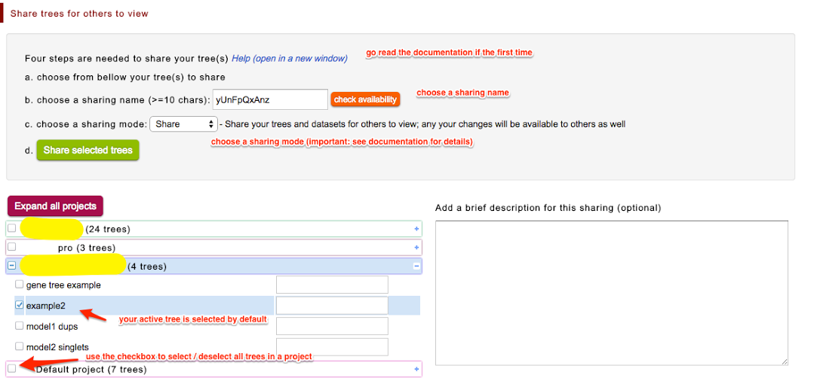
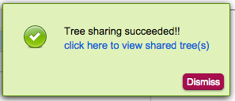
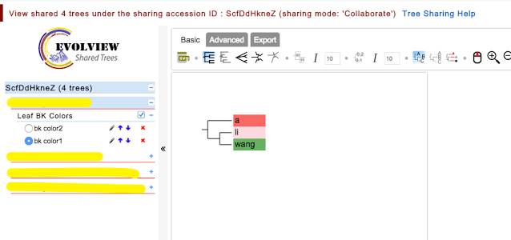
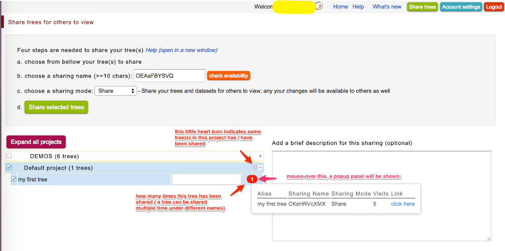

## Share your trees

### Table of contents

* [the interface](#the-interface)
* [sharing modes](#sharing-modes)
* [more about the Tree Sharing page](#more-about-the-Tree-Sharing-page)

_**Note:**_
1. Sharing Trees is still under development; please send suggestions and comments to us.
2. Tree Sharing is a much anticipated feature that allows user to share their trees for others to view and even collaborate with.
3. Please email us ([Evolgenius Team](mailto:evolgenius.team@gmail.com)) if you have any questions; attach your datasets and trees if necessary.
Tree Sharing comes with three different Sharing Modes, each grants different privileges to others; see details bellow.

{anchor:the interface}
### The interface
To go to the Tree Sharing page, simply click the "Share trees" button at the header bar:

You'll be redirected to the Tree Sharing page (see below).
To share a tree or trees, four steps are needed:

1. choose the tree(s) to share;
2. choose a sharing name; it should be at least 10 characters without space;
3. choose a Sharing Mode;
4. click the "Share Selected Trees" button!!

If the sharing is successful, a popup panel will show:

Click the link, you'll be redirected to the Shared Trees page, which contains the following elements:
1. a information bar shows the number of trees under the sharing ID / accession, the Sharing Mode and a link to this Wiki page
2. a streamlined toolbar without the "Annotation upload" tab
3. a modified Evolview logo with text "shared trees"
4. a project panel lists the trees under the sharing ID / accession, and
4. a canvas

See below:

{anchor:sharing modes}
### Sharing modes

So far three Sharing Modes are supported:
* Share (default)
	* all your changes to the trees and datasets will be updated to the shared trees
	* if you delete a shared tree and dataset, they will no longer be available to others
	* others can view and interact with the tree
	* any changes made by others will NOT be saved
* Collaborate (risky)
	* all your changes to the trees and datasets will be updated to the shared trees
	* if you delete a shared tree and dataset, they will no longer be available to others
	* others can view, interact with and edit the tree
	* any changes made by others will be saved
* Publish
	* share a copy of your trees and datasets
	* you will not be able to change / delete the trees and datasets after publishing
	* the published trees and datasets are still there even when you delete the original trees and datasets
	* others can view and interact with the tree
	* any changes made by others will NOT be saved

{anchor:more about the Tree Sharing page}
### More about the Tree Sharing page
The Tree Sharing page contains additional information, see below:

